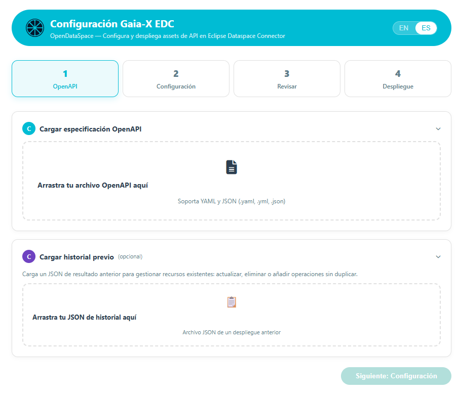

# Connector-Assets-Config

 


Web app for configuring and deploying API assets in Eclipse Dataspace Connector (EDC), following the Gaia-X framework.

<p align="center">
	<a href="https://apiaddicts.org/">
	  
	</a>
</p>

## What it does

It reads an OpenAPI specification, allows you to configure ODRL policies and Gaia-X metadata, and creates the necessary resources in an EDC connector:

- **Assets** — one per operation of the selected API
- **Policies** — Access Policy + Contract Policy (ODRL/JSON-LD)
- **Contract Definition** — links policies to assets

## Requirements

- Node.js 18+
- Access to an EDC connector with Management API v3

## Installation

```bash
git clone <repo-url>
cd opendataspace-edc-config
npm install
```

## Run the project

```bash
npm start
```

The server starts at `http://localhost:3000` (or the port specified in `PORT`).

## Usage

1. Open `http://localhost:3000` in your browser
2. **Step 1 — OpenAPI**: Upload an OpenAPI spec (YAML or JSON). Optionally, upload a JSON file containing the history from a previous deployment to edit existing resources
3. **Step 2 — Configuration**: Enter the EDC Management API URL, service details, provider, catalog, upstream authentication, and ODRL policy level (Level 1/2/3/Custom)
4. **Step 3 — Review**: Verify the preview of policies, assets, and Contract Definition. Edit the CD ID if necessary
5. **Step 4 — Deploy**: Run the reconciliation. The app creates/updates/deletes the necessary resources in the EDC and displays the results
6. **Download results**: The generated JSON can be downloaded and reused as a history for future deployments

## EDC Connector API Endpoints

| Method | URL | Description |
|--------|------|-------------|
| POST | `/api/parse-openapi` | Parses OpenAPI spec, returns operations |
| POST | `/api/create-edc-resources` | Reconciles resources in EDC |
| GET | `/api/configs` | Lists saved configurations |
| GET | `/api/configs/:filename` | Retrieves a saved configuration |
| GET | `/api/health` | Health check |

## Integration via iframe (PostMessage)

The app can be embedded in an iframe. Communication is handled via `postMessage`.

### What the form needs

```json
{
  “openapi_yaml_in_base64”: “string (REQUIRED)”,
  “history_b64”: “string (OPTIONAL — previous configuration for editing)”
}
```

### What the form returns

```json
{
  “files”: [
    {
      “filename”: “edc-config.json”,
      “content_in_base64”: “string (JSON of the deployment result in base64)”
    }
  ]
}
```

## Tech Stack

- **Backend**: Node.js + Express
- **Frontend**: Vanilla JS (no framework, no bundler)
- **EDC API**: Management API v3 (JSON-LD payloads)
- **Policies**: ODRL with EDC contexts + ODRL
- **i18n**: Custom implementation with ES/EN

## UI Workflow

| Step | Name | Description |
|------|--------|-------------|
| 1 | **OpenAPI** | Load OpenAPI spec (YAML/JSON) + optional history |
| 2 | **Configuration** | EDC connection, service, ODRL policies (Level 1/2/3/Custom), catalog, provider, auth |
| 3 | **Review** | Preview policies, assets, and Contract Definition before deployment. Allows editing the CD ID |
| 4 | **Deployment** | Reconciles resources in EDC and displays results |

## History and Edits

### Loading Previous History (Step 1)

When loading a JSON file containing the results of a previous deployment, the app:

1. **Pre-fills the form** — EDC URL, service, provider, catalog, and auth are retrieved from the history
2. **Marks operations as “Deployed”** — compares the asset IDs in the history with the operations in the current OpenAPI
3. **Detects changes** — in Step 3, it shows how many assets are new, how many will be updated, and how many will be deleted
4. **Allows incremental editing** — add/remove operations, change policies, modify metadata without losing previous data

### Typical Editing Workflow

```
1. Load OpenAPI (new or existing)
2. Load JSON from the previous deployment history
3. Make changes:
   - Check/uncheck operations → adds/removes assets
   - Change policy level → updates policies
   - Edit metadata → updates assets
4. Step 3 shows a preview with diff: “3 new, 5 will be updated, 1 will be removed”
5. Deploy → the reconciler applies only the necessary changes
```

### Downloadable Output

After each deployment, a JSON file is generated containing:
- Complete configuration (EDC URL, service, provider, policies, catalog)
- Created resources (assets, policies, contract definition) along with their payloads and statuses
- Timestamp

This JSON file serves as a history for the next deployment and is automatically saved in `output/`.

## EDC Reconciliation

The reconciler follows this order during deployment:

1. **Delete existing Contract Definition** (unlocks policies/assets)
2. **Detect conflicts** — if there is an active Contract Agreement, the CD cannot be deleted (409)
3. **Create/update Policies** (DELETE + POST; EDC does not support actual PUT operations on policies)
4. **Create/update Assets** (DELETE + POST) + remove obsolete assets from history
5. **Create Contract Definition** with the ID chosen by the user

### Why DELETE + POST Instead of PUT

- EDC returns a **405** error on PUT requests for assets (not supported)
- EDC **accepts** PUT on policies but **silently ignores the changes**
- Solution: always DELETE the existing resource + POST the new one
- Policies cannot be deleted while they are referenced by a CD → that is why the CD is deleted first (step 1) 

## Error Handling

### Policy Rejected by the Connector (HTTP 422)

If the EDC connector does not support the selected policy level (e.g., Level 2 or 3 without Java extensions installed):

1. The server detects the error when attempting to create the policy (the EDC returns a 400 error)
2. **The entire deployment is halted** — no assets or Contract Definitions are created
3. The frontend returns to **Step 2** (policy configuration)
4. An error banner is displayed showing:
   - Which policy was rejected and the EDC error
   - What the connector **does support** (Level 1, native operators `eq`/`neq`/`in`)
   - What it **does not support** without Java extensions (Level 2, Level 3, custom leftOperands) 

### Conflict due to active contract (HTTP 409)

When there is a Contract Agreement negotiated on the current Contract Definition, the EDC does not allow the CD to be deleted. The flow is:

1. The reconciler detects the 409 error when attempting to delete the CD
2. A **diff** is calculated by checking the current status in the EDC:
   - Changes in policies (current vs. desired)
   - Assets added, removed, and unchanged
3. A **conflict dialog** is displayed with 3 options:

| Option | Behavior |
|--------|---------------|
| **Delete and recreate** | Attempts to force DELETE + POST with the same ID. If the EDC blocks it, displays the actual error |
| **Create new CD** | Creates a CD with a versioned ID (`{id}-v{timestamp}`), reusing the same policies. The previous CD continues to serve existing contracts |
| **Cancel** | Returns to Step 3 without making changes |

### Connection Errors

If the server or the EDC connector does not respond, a network error is displayed in Step 4 with the option to retry.

### Warnings in the policy editor (Step 2)

- **Level 2/3**: A warning is displayed indicating that Java extensions are required (SSI Gaia-X)
- **Custom operators/leftOperands**: A warning for `PolicyFunction required` is displayed, explaining that without the Java extension, the EDC will silently evaluate the constraint as TRUE (security risk)

## ODRL Policies

### Dual Structure

The Contract Definition requires **two separate policies**:

- **Access Policy** — controls who **views** the asset in the catalog. Action: `access`
- **Contract Policy** — controls who can **negotiate** a contract. Action: `use`

Each is configured independently with its own level and constraints.

### Levels

| Level | Description | Constraints | Connector Requirements |
|-------|-------------|-------------|------------------------|
| Level 1 | Open Use | None (`odrl:use` without restrictions) | Vanilla EDC |
| Level 2 | Gaia-X Membership | `Membership eq active` + `distribute` prohibition | Gaia-X SSI Extension |
| Level 3 | EU Sovereignty | Membership + `DataProcessing.location eq EU/EEA` + transfer/distribute/derive prohibitions | 2 SSI extensions + EU infrastructure |
| Custom | Open Editor | Configurable constraints, prohibitions, and obligations | Depends on the operators used |

### JSON-LD Format

Policies are sent to the EDC in this format:

```json
{
  “@context”: { “@vocab”: “https://w3id.org/edc/v0.0.1/ns/” },
  “@type”: “PolicyDefinition”,
  “@id”: “{slug}-access-policy”,
  “policy”: {
    “@context”: “http://www.w3.org/ns/odrl.jsonld”,
    “@type”: “Set”,
    “permission”: [{ ‘action’: “use” }]
  }
}
```

The outer namespace is EDC (`@vocab`), and the inner namespace is standard ODRL.

### Custom Policy Editor

The editor allows you to add:

- **Constraints** (permission) — leftOperand + operator + rightOperand. Complete catalog of Catena-X and Gaia-X operands with autocomplete for known values
- **Prohibitions** — ODRL actions that the consumer CANNOT perform (distribute, transfer, derive, etc.), with optional constraints
- **Obligations** — actions that the consumer MUST perform (inform, compensate, etc.), with optional constraints

Native EDC operators (without extensions): `eq`, `neq`, `in`. Any other custom operator or leftOperand requires a Java PolicyFunction.

## Contract Definition

### ID Generation

- Auto-generated: `{slugify(apiName)}-contract-def`
- Editable in Step 3 — the user can change it before deployment
- If there is a conflict and the user chooses “Create New,” it is versioned: `{id}-v{timestamp}`

### Structure

```json
{
  "@context": { "@vocab": "https://w3id.org/edc/v0.0.1/ns/" },
  "@type": "ContractDefinition",
  "@id": "{slug}-contract-def",
  "accessPolicyId": "{slug}-access-policy",
  "contractPolicyId": "{slug}-contract-policy",
  "assetsSelector": [{
    "@type": "CriterionDto",
    "operandLeft": "https://w3id.org/edc/v0.0.1/ns/id",
    "operator": "in",
    "operandRight": ["asset-id-1", "asset-id-2"]
  }]
}
```

## Assets

Each selected operation from the OpenAPI is converted into an EDC asset with:

- **ID**: `{slug}-{operationId}`
- **Metadata**: name, description, version, HTTP method, path, summary
- **Catalog**: keywords, language, contentType, creator
- **Provider**: DID, business name, copyright, SPDX license, email, country, terms
- **Data Address**: upstream URL + basePath + operation path
- **Auth**: depending on the selected mode (none, API key, vault, OAuth2 client credentials)

## Upstream Authentication

| Mode | Description | Field in dataAddress |
|------|-------------|---------------------|
| **None** | No authentication | — |
| **API Key / Token** | Header + static value | `authKey` + `authCode` |
| **Vault** | Header + EDC vault secret | `authKey` + `secretName` |
| **OAuth2** | Automatic client credentials | `oauth2:tokenUrl` + `oauth2:clientId` + `oauth2:clientSecretKey` |

